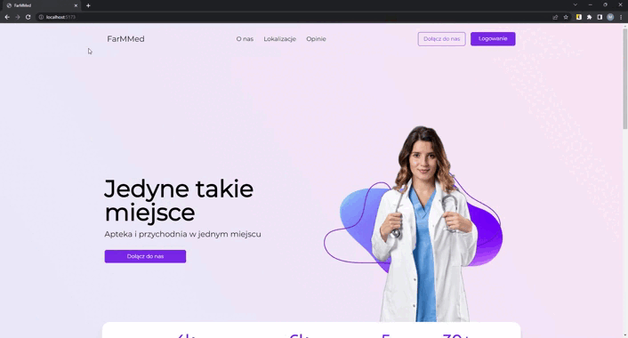

# farmmed-website

  <strong>Strona główna</strong>

  

  <strong>Błędne logowanie</strong>

  

  <strong>Poprawne logowanie</strong>

  

  <strong>Rejestracja pacjenta</strong>

  

  <strong>Przeglądanie i edycja bazy z lekami</strong>

  

  <strong>Uaktualnianie bazy o najnowszy plik stworzony przez ministerstwo zdrowia</strong>

  

  <strong>Tworzenie harmonogramu lekarza przez administartora serwisu</strong>

  

  <strong>Utworzone terminu przyjęć w bazie mysql</strong>

  

  <strong>Zarządzanie użytkownikami</strong>

  

  <strong>Przeglądanie kartotek z poziomu pacjenta</strong>

  

  <strong>Wyświetlanie pacjentowi jego aktualnych recept</strong>

  

  <strong>Rejestracja pacjenta na wizytę</strong>

  

  <strong>Zmiana danych pacjenta, lekarza, aptekarza z poziomu ich panelu</strong>

  

  <strong>Podgląd pacjentów do przyjęcia w dniu dzisiejszym</strong>

  

  <strong>Dodanie wpisu do kartoteki pacjenta</strong>

  

  <strong>Wystawienie recepty pacjentowi</strong>

  

  <strong>Realizacja recepty w aptece</strong>

  

  <strong>Cały film</strong>

  

